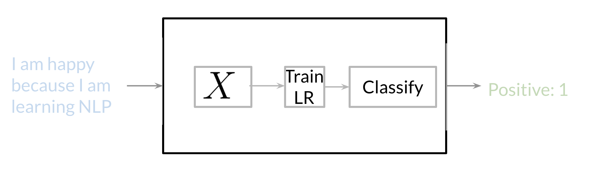

# Supervised ML & Sentiment Analysis

In supervised machine learning, you usually have an input X, which goes into your prediction function to get your \hat Y. You can then compare your prediction with the true value Y. This gives you your cost which you use to update the parameters \theta. The following image, summarizes the process. 

To perform sentiment analysis on a tweet, you first have to represent the text (i.e. "I am happy because I am learning NLP ") as features, you then train your logistic regression classifier, and then you can use it to classify the text.

Note that in this case, you either classify 1, for a positive sentiment, or 0, for a negative sentiment. 

