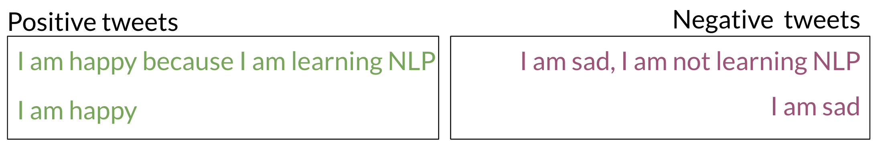
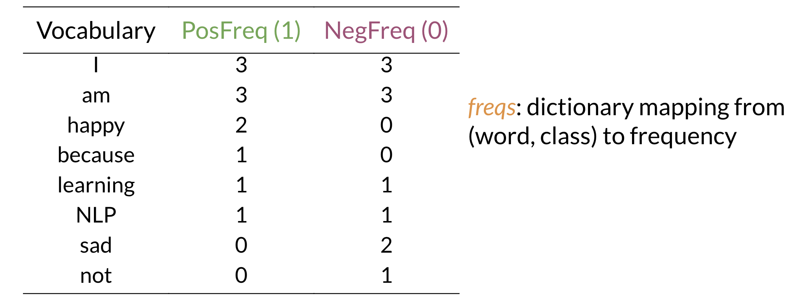

# Given a corpus with positive and negative tweets as follows: 

You have to encode each tweet as a vector. Previously, this vector was of dimension VV. Now, as you will see in the upcoming videos, you will represent it with a vector of dimension 33. To do so, you have to create a dictionary to map the word, and the class it appeared in (positive or negative) to the number of times that word appeared in its corresponding class. 

In the past two videos, we call this dictionary `freqs`. In the table above, you can see how words like happy and sad tend to take clear sides, while other words like "I, am" tend to be more neutral. Given this dictionary and the tweet, "I am sad, I am not learning NLP", you can create a vector corresponding to the feature as follows: 

To encode the negative feature, you can do the same thing.

Hence you end up getting the following feature vector [1,8,11][1,8,11]. 11 corresponds to the bias, 88 the positive feature, and 1111 the negative feature. 