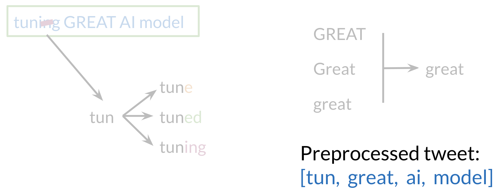

# Preprocessing

When preprocessing, you have to perform the following:

1. Eliminate handles and URLs
2. Tokenize the string into words. 
3. Remove stop words like "and, is, a, on, etc."
4. Stemming- or convert every word to its stem. Like dancer, dancing, danced, becomes 'danc'. You can use porter stemmer to take care of this. 
5. Convert all your words to lower case. 

For example the following tweet "@YMourri and @AndrewYNg are tuning a GREAT AI model at https://deeplearning.ai!!!" after preprocessing becomes

[*tun,great,ai,model*]. Hence you can see how we eliminated handles, tokenized it into words, removed stop words, performed stemming, and converted everything to lower case. 