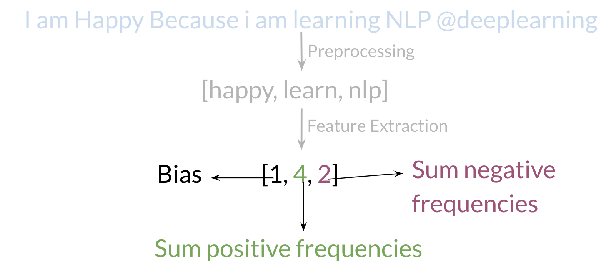
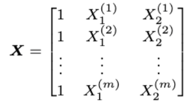
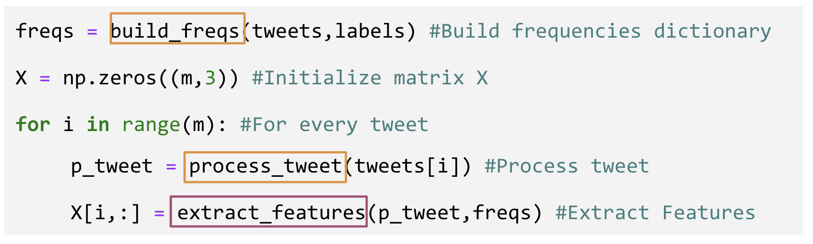

# Putting it all together

Over all , you start with a given text, you perform preprocessing, then you do feature extraction to convert text into numerical representation as follows:

Your X becomes of dimension (m,3)(m,3) as follows.

When implementing it with code, it becomes as follows:

You can see in the last step you are storing the extracted features as rows in your XX matrix and you have mm of these examples. 