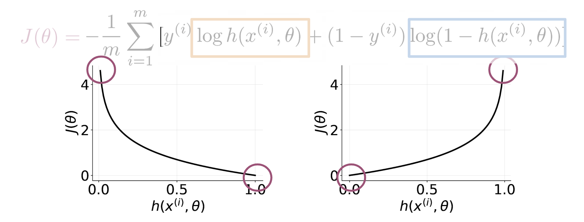

# Optional Logistic Regression: Cost Function
This is an advanced optional reading where we delve into the details.. If you do not get the math, do not worry about it - you will be just fine by moving onto the next component. In this part, I will tell you about the intuition behind why the cost function is designed the way it is. I will then show you how to derive the logistic regression cost function to get the gradients. 

The logistic regression cost function is defined as 

 J(\theta)=-\frac{1}{m} \sum_{i=1}^{m}\left[y^{(i)} \log h\left(x^{(i)}, \theta\right)+\left(1-y^{(i)}\right) \log \left(1-h\left(x^{(i)}, \theta\right)\right)\right]J(θ)=− 
m
1
​	
 ∑ 
i=1
m
​	
 [y 
(i)
 logh(x 
(i)
 ,θ)+(1−y 
(i)
 )log(1−h(x 
(i)
 ,θ))]

As you can see in the picture above, if y = 1y=1 and you predict something close to 00, you get a cost close to \infty∞. The same applies for then y=0y=0 and you predict something close to 11. On the other hand if you get a prediction equal to the label, you get a cost of 0. In either, case you are trying to minimize J(\theta)J(θ). 

Math Derivation
To show you why the cost function is designed that way, let us take a step 
back and write up a function that compresses the two cases into one case. 

P(y | x^{(i)}, \theta ) = h(x^{(i)}, \theta)^{y^{(i)}} (1-h(x^{(i)}, \theta)^{(1-y^{(i)})}P(y∣x 
(i)
 ,θ)=h(x 
(i)
 ,θ) 
y 
(i)
 
 (1−h(x 
(i)
 ,θ) 
(1−y 
(i)
 )
 

From the above, you can see that when y = 1y=1, you get h( x^{(i)}, \theta)h(x 
(i)
 ,θ), and when y = 0y=0, you get (1-h( x^{(i)}, \theta))(1−h(x 
(i)
 ,θ)), which makes sense, since the two probabilities equal to 1. In either case, you want to maximize the function h( x^{(i)}, \theta) h(x 
(i)
 ,θ) by making it as close to 11 as possible. When y=0y=0, you want (1-h( x^{(i)}, \theta))(1−h(x 
(i)
 ,θ)) to be 00, and therefore  h( x^{(i)}, \theta)h(x 
(i)
 ,θ) close to 11. When y=1y=1, you want h( x^{(i)}, \theta)=1h(x 
(i)
 ,θ)=1.

Now we want to find a way to model the entire data set and not just one example. To do so, we will define the likelihood as follows: 

L(\theta) = \prod_{i=1}^m  h(\theta, x^{(i)})^{y^{(i)}} (1-h(\theta, x^{(i)}))^{(1-y^{(i)})}L(θ)=∏ 
i=1
m
​	
 h(θ,x 
(i)
 ) 
y 
(i)
 
 (1−h(θ,x 
(i)
 )) 
(1−y 
(i)
 )
 

The \prod∏ symbol tells you that you are multiplying the terms together and not adding them. Note that if we mess up the classification of one example, we end up messing up the overall likelihood score, which is exactly what we intended. We want to fit a model to the entire dataset where all data points are related. One issue is that as mm gets larger, what happens to L(\theta)L(θ)? It goes close to zero, because both numbers  h(x^{(i)}, \theta)h(x 
(i)
 ,θ) and  (1-h(x^{(i)}, \theta))(1−h(x 
(i)
 ,θ)) are bounded between 00 and 11. Since we are trying to maximize h(\theta, x^{(i)})h(θ,x 
(i)
 ) in L(\theta)L(θ), we can introduce the log and just maximize the log of the function. (We are maximizing the same function just in a different space). Introducing the \loglog, allows us to write the \loglog of a product as the sum of each \loglog. Here are two identities that will come in handy: 

 \log a*b*c = \log a + \log b + \log c loga∗b∗c=loga+logb+logc

 \log a^b = b \log a loga 
b
 =bloga

Given the two identities above, we can rewrite the equation as follows: 

\max_{h(x^{(i)}, \theta )} \log L(\theta) = \log \prod_{i=1}^m h(x^{(i)}, \theta)^{y^{(i)}} (1-h(x^{(i)}, \theta)^{(1-y^{(i)})} max 
h(x 
(i)
 ,θ)
​	
 logL(θ)=log∏ 
i=1
m
​	
 h(x 
(i)
 ,θ) 
y 
(i)
 
 (1−h(x 
(i)
 ,θ) 
(1−y 
(i)
 )
 

 = \sum_{i=1}^m  \log  h(x^{(i)}, \theta)^{y^{(i)}} (1-h(x^{(i)}, \theta)^{(1-y^{(i)})} =∑ 
i=1
m
​	
 logh(x 
(i)
 ,θ) 
y 
(i)
 
 (1−h(x 
(i)
 ,θ) 
(1−y 
(i)
 )
 

= \sum_{i=1}^m  \log h(x^{(i)}, \theta)^{y^{(i)}}  + \log (1-h(x^{(i)}, \theta)^{(1-y^{(i)})} =∑ 
i=1
m
​	
 logh(x 
(i)
 ,θ) 
y 
(i)
 
 +log(1−h(x 
(i)
 ,θ) 
(1−y 
(i)
 )
 

= \sum_{i=1}^m  y^{(i)}  \log  h(x^{(i)}, \theta)+ (1-y^{(i)})  \log (1-h(x^{(i)}, \theta))=∑ 
i=1
m
​	
 y 
(i)
 logh(x 
(i)
 ,θ)+(1−y 
(i)
 )log(1−h(x 
(i)
 ,θ))

Hence, we now divide by mm, because we want to see the average cost. 

\frac {1}{m} \sum_{i=1}^m  y^{(i)}  \log  h(x^{(i)}, \theta) + (1-y^{(i)})  \log (1- h(x^{(i)}, \theta)) 
m
1
​	
 ∑ 
i=1
m
​	
 y 
(i)
 logh(x 
(i)
 ,θ)+(1−y 
(i)
 )log(1−h(x 
(i)
 ,θ))

Remember that we were maximizing h(\theta, x^{(i)})h(θ,x 
(i)
 ) in the equation above. It turns out that maximizing an equation is the same as minimizing its negative. Think of x^2x 
2
 , feel free to plot it to see that for you yourself. Hence we add a negative sign and we end up minimizing the cost function as follows. 

 J(\theta)=-\frac{1}{m} \sum_{i=1}^{m}\left[y^{(i)} \log h\left(x^{(i)}, \theta\right)+\left(1-y^{(i)}\right) \log \left(1-h\left(x^{(i)}, \theta\right)\right)\right]J(θ)=− 
m
1
​	
 ∑ 
i=1
m
​	
 [y 
(i)
 logh(x 
(i)
 ,θ)+(1−y 
(i)
 )log(1−h(x 
(i)
 ,θ))]

A vectorized implementation is:

h=g(Xθ)J(θ)=1m⋅(−yTlog(h)−(1−y)Tlog(1−h))
