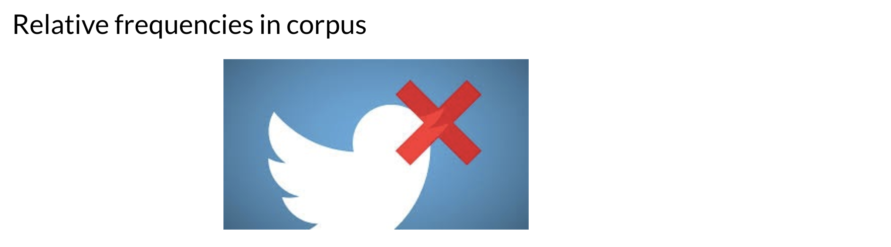

# Naïve Bayes Assumptions

Naïve Bayes makes the independence assumption and is affected by the word frequencies in the corpus. For example, if you had the following

In the first image, you can see the word sunny and hot tend to depend on each other and are correlated to a certain extent with the word "desert". Naive Bayes assumes independence throughout. Furthermore, if you were to fill in the sentence on the right, this naive model will assign equal weight to the words "spring, summer, fall, winter". 

On Twitter, there are usually more positive tweets than negative ones. However, some "clean" datasets you may find are artificially balanced to have to the same amount of positive and negative tweets. Just keep in mind, that in the real world, the data could be much noisier. 