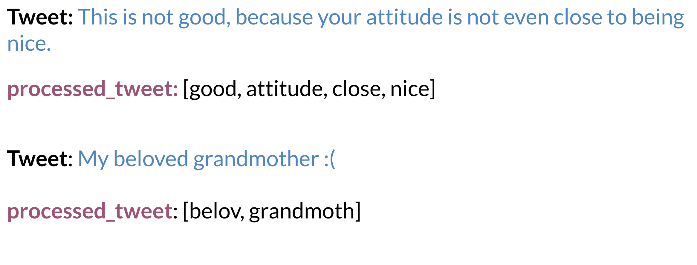
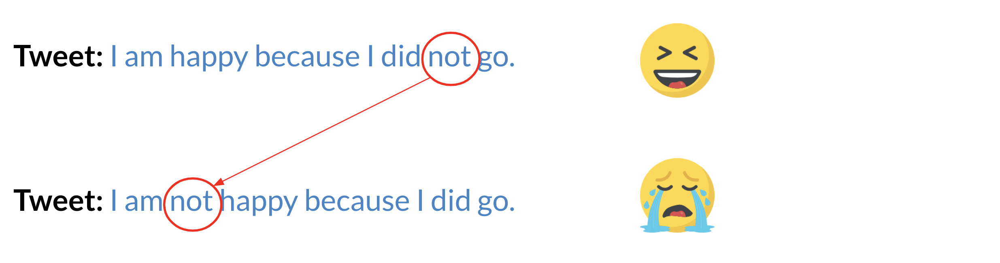

# Error Analysis

There are several mistakes that could cause you to misclassify an example or a tweet. For example, 

* Removing punctuation

* Removing words

* Word order

* Adversarial attacks

These include sarcasm, irony, euphemisms.