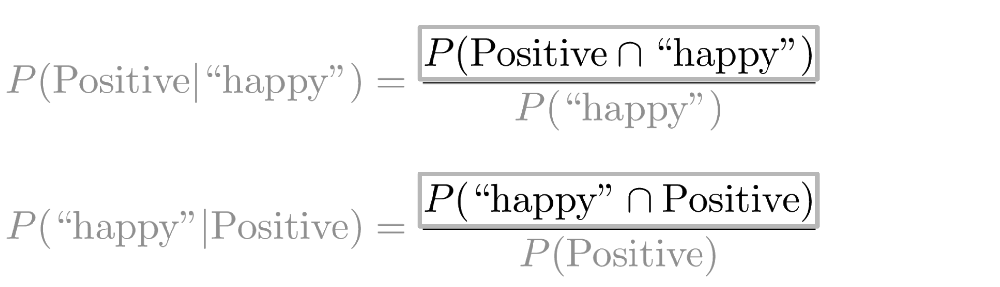

# Bayes' Rule

Conditional probabilities help us reduce the sample search space. For example given a specific event already happened, i.e. we know the word is happy:

Then you would only search in the blue circle above. The numerator will be the red part and the denominator will be the blue part. This leads us to conclude the following: 

Substituting the numerator in the right hand side of the first equation, you get the following: 

Note that we multiplied by P(positive) to make sure we don't change anything.  That concludes Bayes Rule which is defined as 

P(X|Y) = \frac{P(Y|X) P(X)}{P(Y)}.
 