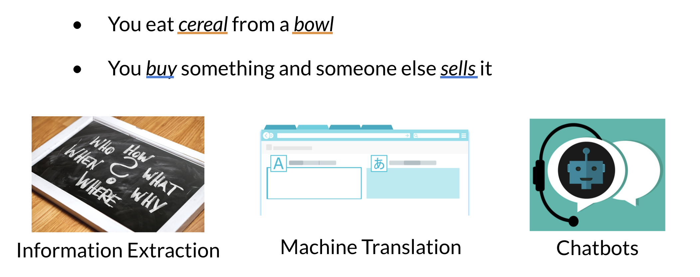

# Vector Space Models

Vector spaces are fundamental in many applications in NLP. If you were to represent a word, document, tweet, or any form of text, you will probably be encoding it as a vector. These vectors are important in tasks like information extraction, machine translation, and chatbots. Vector spaces could also be used to help you identify relationships between words as follows: 

The famous quote by Firth says, "You shall know a word by the company it keeps". When learning these vectors, you usually make use of the neighboring words to extract meaning and information about the center word. If you were to cluster these vectors together, as you will see later in this specialization, you will see that adjectives, nouns, verbs, etc. tend to be near one another. Another cool fact, is that synonyms and antonyms are also very close to one another. This is because you can easily interchange them in a sentence and they tend to have similar neighboring words!