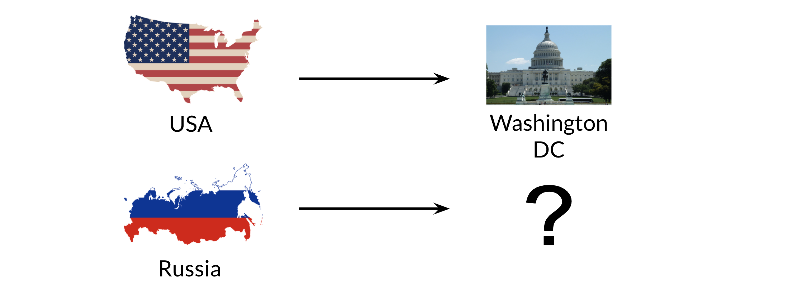

# Manipulating Words in Vector Spaces

You can use word vectors to actually extract patterns and identify certain structures in your text. For example: 

You can use the word vector for Russia, USA, and DC to actually compute a **vector** that would be very similar to that of Moscow. You can then use cosine similarity of the vector with all the other word vectors you have and you can see that the **vector** of Moscow is the closest. Isn't that cool? 

Note that the distance (and direction) between a country and its capital is relatively the same. Hence manipulating word vectors allows you identify patterns in the text. 

