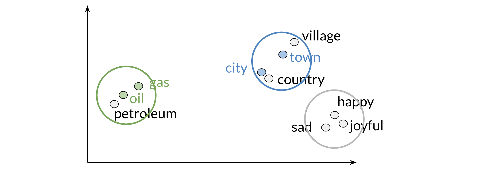

# Visualization and PCA

Principal component analysis is an unsupervised learning algorithm which can be used to reduce the dimension of your data. As a result, it allows you to visualize your data. It tries to combine variances across features. Here is a concrete example of PCA: 

Note that when doing PCA on this data, you will see that oil & gas are close to one another and town & city are also close to one another. To plot the data you can use PCA to go from d>2 dimensions to d=2. 

Those are the results of plotting a couple of vectors in two dimensions. Note that words with similar part of speech (POS) tags are next to one another. This is because many of the training algorithms learn words by identifying the neighboring words. Thus, words with similar POS tags tend to be found in similar locations. An interesting insight is that synonyms and antonyms tend to be found next to each other in the plot. Why is that the case?