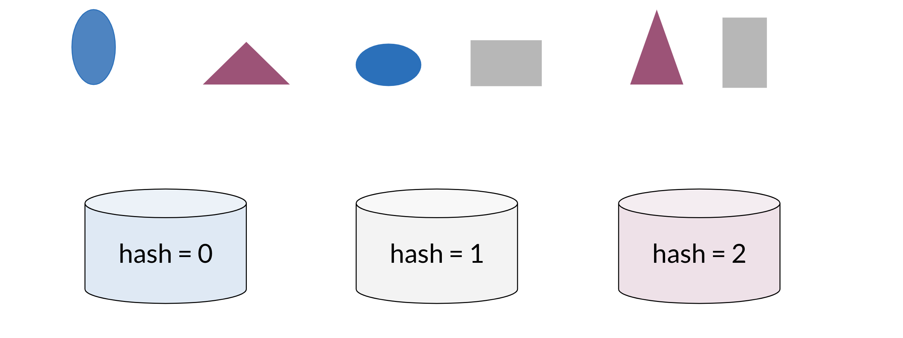
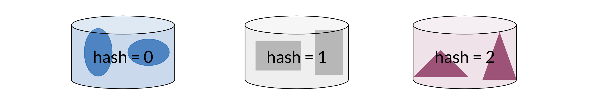
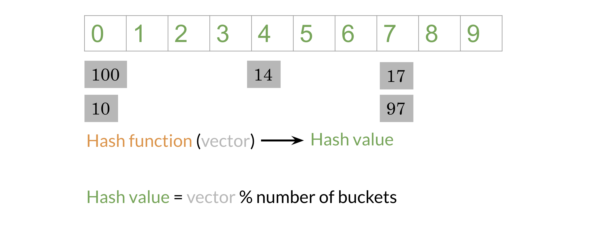
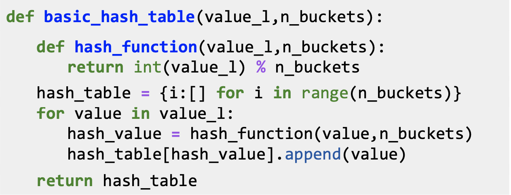

# Hash tables and hash functions

Imagine you had to cluster the following figures into different buckets: 

Note that the figures blue, red, and gray ones would each be clustered with each other

You can think of hash function as a function that takes data of arbitrary sizes and maps it to a fixed value. The values returned are known as hash values or even hashes. 

The diagram above shows a concrete example of a hash function which takes a vector and returns a value. Then you can mod that value by the number of buckets and put that number in its corresponding bucket. For example, 14 is in the 4th bucker, 17 & 97 are in the 7th bucket. Let's take a look at how you can do it using some code. 

The code snippet above creates a basic hash table which consists of hashed values inside their buckets. **hash_function** takes in value_l (a list of values to be hashed) and n_buckets and mods the value by the buckets. Now to create the hash_table, you first initialize a list to be of dimension n_buckets (each value will go to a bucket). For each value in your list of values, you will feed it into your **hash_function**, get the hash_value, and append it to the list of values in the corresponding bucket.

Now given an input, you don't have to compare it to all the other examples, you can just compare it to all the values in the same hash_bucket that input has been hashed to. 

When hashing you sometimes want similar words or similar numbers to be hashed to the same bucket. To do this, you will use “locality sensitive hashing.”  Locality is another word for “location”.  So locality sensitive hashing is a hashing method that cares very deeply about assigning items based on where they’re located in vector space. 