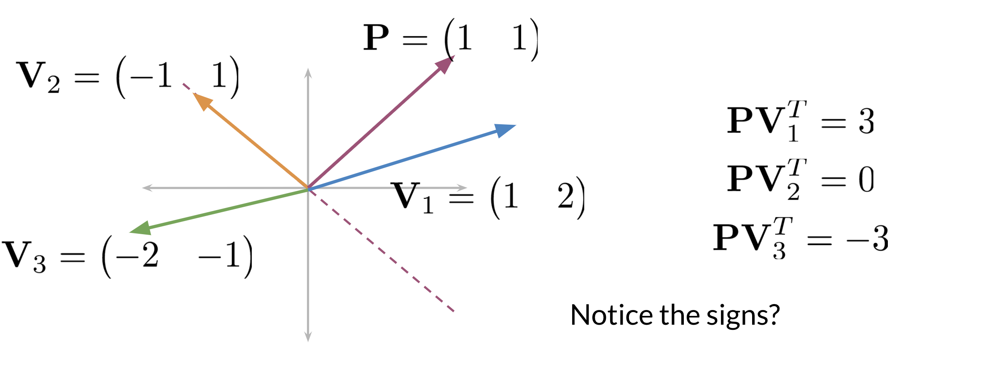
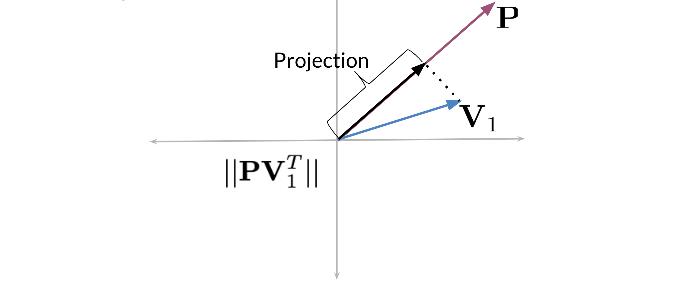

# Locality sensitive hashing

Locality sensitive hashing is a technique that allows you to hash similar inputs into the same buckets with high probability. 

Instead of the typical buckets we have been using, you can think of clustering the points by deciding whether they are above or below the line. Now as we go to higher dimensions (say n-dimensional vectors), you would be using planes instead of lines. Let's look at a concrete example: 

Given some point located at (1,1) and three vectors V_1 = (1,2), V_2 = (-1,1), V_3 = (-2,-1) you will see what happens when we take the dot product. First note that the dashed line is our plane. The vector with point P = (1,1) is perpendicular to that line (plane). Now any vector above the dashed line that is multiplied by (1,1) would have a positive number. Any vector below the dashed line when dotted with (1,1) will have a negative number. Any vector on the dashed line multiplied by (1,1) will give you a dot product of 0. 

Here is how to visualize a projection (i.e. a dot product between two vectors):

When you take the dot product of a vector V_1 and a P, then you take the magnitude or length of that vector,  you get the black line (labelled as  Projection). The sign indicates on which side of the plane the projection vector lies.