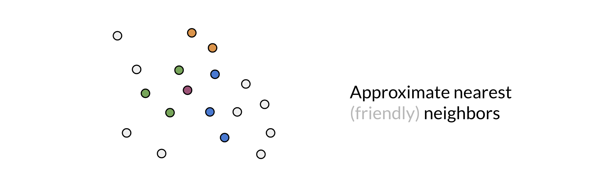
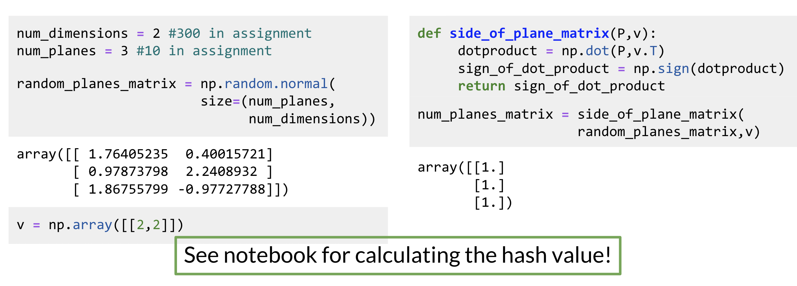

# Approximate nearest neighbors

Approximate nearest neighbors does not give you the full nearest neighbors but gives you an approximation of the nearest neighbors. It usually trades off accuracy for efficiency. Look at the following plot: 

You are trying to find the nearest neighbor for the red vector (point). The first time, the plane gave you green points. You then ran it a second time, but this time you got the blue points. The third time you got the orange points to be the neighbors. So you can see as you do it more times, you are likely to get all the neighbors. Here is the code for one set of random planes. Make sure you understand what is going on. 

