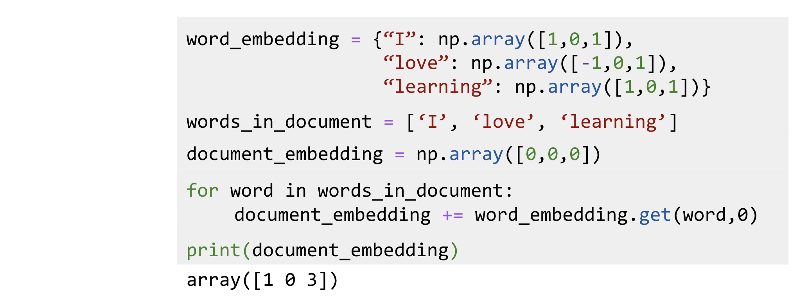
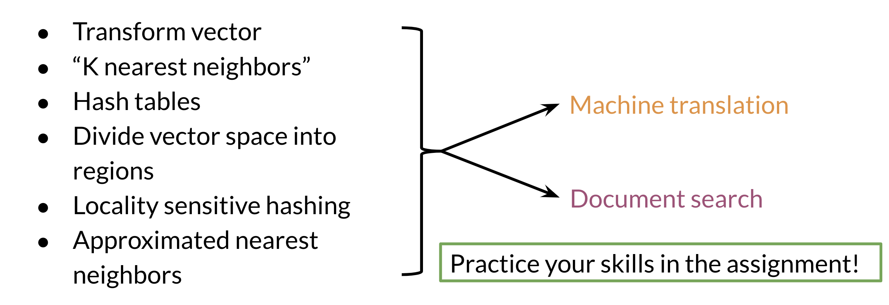

# Searching documents

The previous video shows you a toy example of how you can actually represent a document as a vector. 

In this example, you just add the word vectors of a document to get the document vector. So in summary you should now be familiar with the following concepts: 

Good luck with the programming assignment!

