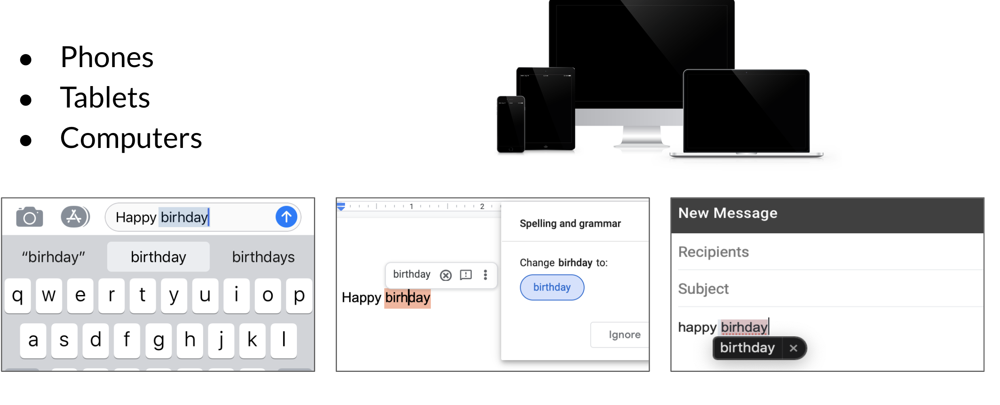

# Autocorrect

Autocorrects are used everywhere. You use them in your phones, tablets, and computers. 

To implement autocorrect in this week's assignment, you have to follow these steps: 

* Identify a misspelled word
* Find strings n edit distance away: (these could be random strings)
* Filter candidates: (keep only the real words from the previous steps)
* Calculate word probabilities: (choose the word that is most likely to occur in that context)
