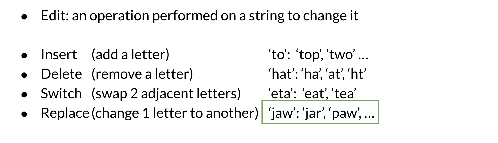
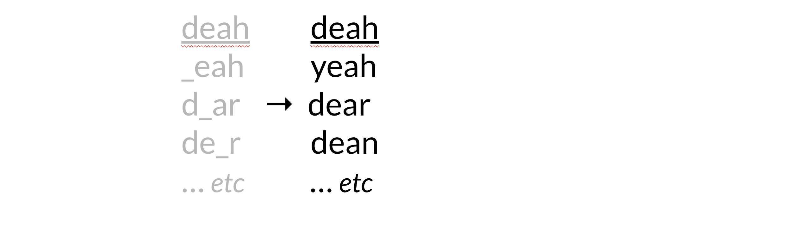

# Building the model

## 1. Identify the misspelled word

When identifying the misspelled word, you can check whether it is in the vocabulary. If you don't find it, then it is probably a typo.

## 2. Find strings n edit distance away

## 3. Filter candidates

In this step, you want to take all the words generated above and then only keep the actual words that make sense and that you can find in your vocabulary.

