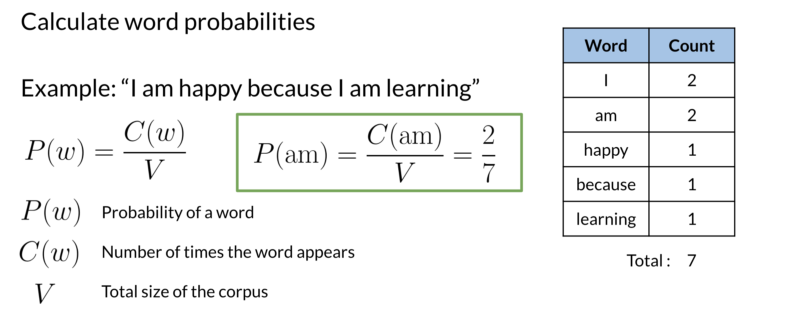
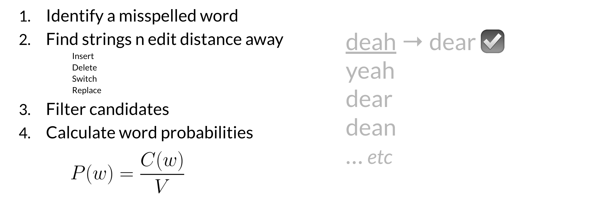

# Building the model II

## 4 Calculating word probabilities

Note that you are storing the count of words and then you can use that to generate the probabilities. For this week, you will be counting the probabilities of words occurring.  If you want to build a slightly more sophisticated auto-correct you can keep track of two words occurring next to each other instead. You can then use the previous word to decide. For example which combo is more likely, there friend or their friend?  For this week however you will be implementing the probabilities by just using the word frequencies. Here is a summary of everything you have seen before in the previous two videos. 

