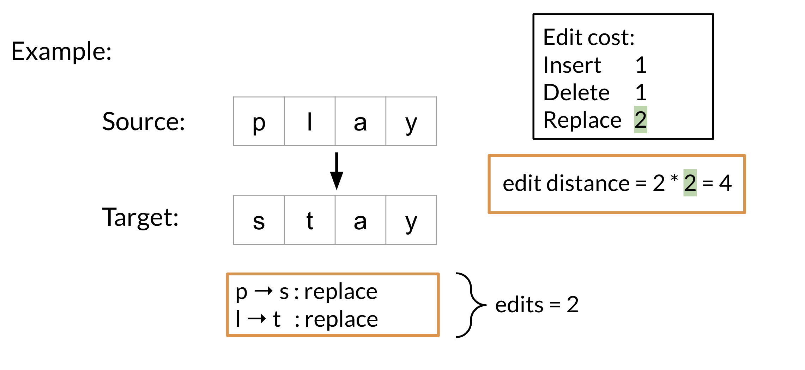

# Minimum edit distance

**Minimum edit distance allows you to:**

* Evaluate similarity between two strings
* Find the minimum number of edits between two strings
* Implement spelling correction, document similarity, machine translation, DNA sequencing, and more

**Remember that the edits include:**

* Insert 	(add a letter)				    ‘to’:  ‘top’, ‘two’ …
* Delete	(remove a letter)			    ‘hat’: ‘ha’, ‘at’, ‘ht’
* Replace	(change 1 letter to another)	‘jaw’: ‘jar’, ‘paw’, …

Here is a concrete example where we calculate the cost (i.e. edit distance) between two strings. 

Note that as your strings get larger it gets much harder to calculate the minimum edit distance. Hence you will now learn about the minimum edit distance algorithm!
