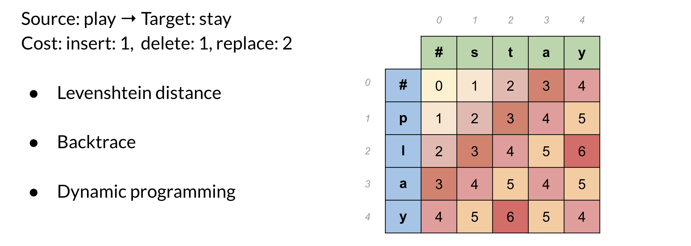

# Minimum edit distance III

To summarize, you have seen the Levenshtein distance which specifies the cost per operation. If you need to reconstruct the path of how you got from one string to the other, you can use a backtrace. You should keep a simple pointer in each cell letting you know where you came from to get there. So you know the path taken across the table from the top left corner, to the bottom right corner. You can then reconstruct it. 

This method for computation instead of brute force is a technique known as <u>dynamic programming</u>. You first solve the smallest subproblem first and then reusing that result you solve the next biggest subproblem, saving that result, reusing it again, and so on. This is exactly what you did by populating each cell from the top right to the bottom left. It’s a well-known technique in computer science! 
