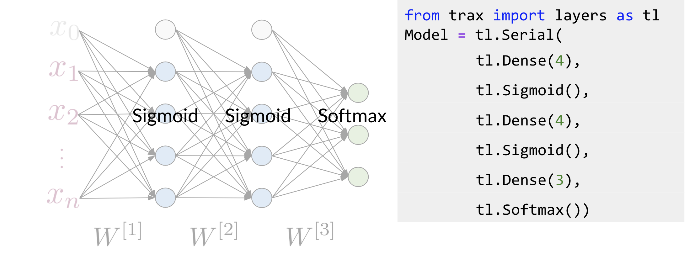

# Trax: Neural Networks

**Trax** has several advantages: 

* Runs fast on CPUs, GPUs and TPUs
* Parallel computing
* Record algebraic computations for gradient evaluation

Here is an example of how you can code a neural network in Trax: 

