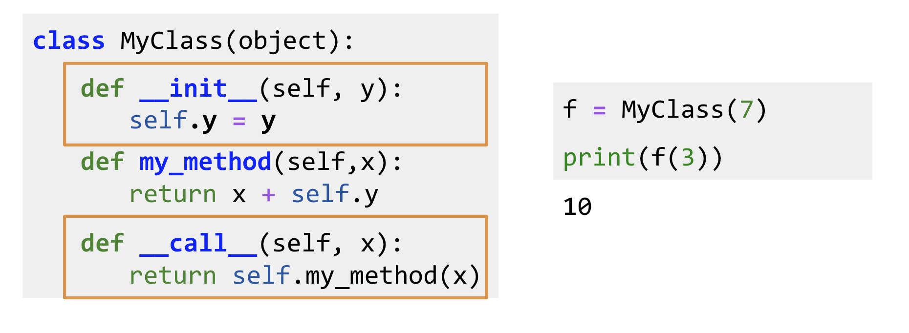

# Trax: Layers

Trax makes use of classes. If you are not familiar with classes in python, don't worry about it, here is an example. 

In the example above, you can see that a class  takes in an *\_\_init__* and a *\_\_call__* method. These methods allow you to initialize your internal variables and allow you to execute your function when called. To the right you can see how you can initialize your class. When you call *MyClass(7)* , you are setting the *y* variable to 7. Now when you call *f(3)* you are adding *7 + 3*. You can change the *my_method* function to do whatever you want, and you can have as many methods as you want in a class.  
