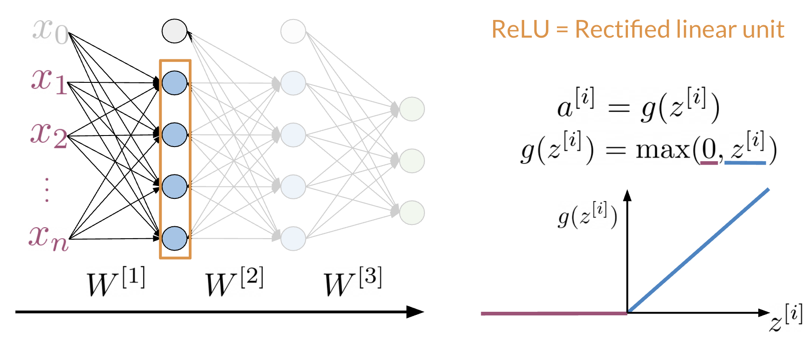

# Dense and ReLU layer

The Dense layer is the computation of the inner product between a set of trainable weights (weight matrix) and an input vector.  The visualization of the dense layer could be seen in the image below. 

The orange box shows the dense layer. An activation layer is the set of blue nodes. Concretely one of the most commonly used activation layers is the rectified linear unit (ReLU).

*ReLU(x)* is defined as *max(0,x)* for any input x. 

