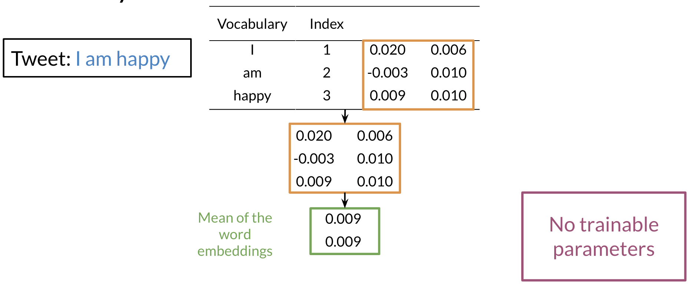

# Other Layers

Other layers could include embedding layers and mean layers. For example, you can learn word embeddings for each word in your vocabulary as follows: 

The mean layer allows you to take the average of the embeddings. You can visualize it as follows: 

This layer does not have any trainable parameters. 

