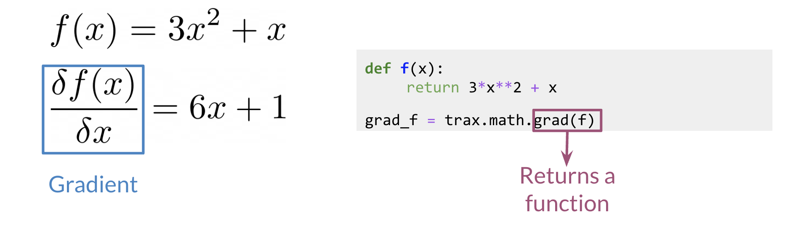

# Training

In Trax, the function grad allows you to compute the gradient. You can use it as follows: 

Now if you were to evaluate *grad_f* at a certain value, namely *z*, it would be the same as computing *6z+1*.  Now to do the training, it becomes very simple: 

You simply compute the gradients by feeding in y.forward (the latest value of y), the weights, and the input x, and then it does the back-propagation for you in a single line. You can then have the loop that allows you to update the weights (i.e. gradient descent!).

