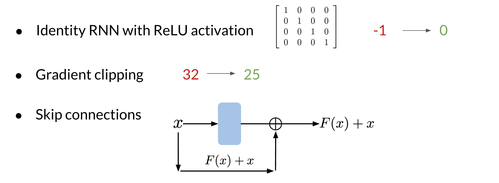

# RNNs and Vanishing Gradients

## Advantages of RNNs

RNNs allow us to capture dependancies within a short range and they take up less RAM than other n-gram models. 

## Disadvantages of RNNs

RNNs struggle with longer term dependencies and are very prone to vanishing or exploding gradients.

Note that as you are back-propagating through time, you end up getting the following: 

Note that the *sigmoid* and tanh functions are bounded by 0 and 1 and -1 and 1 respectively. This eventually leads us to a problem. If you have many numbers that are less than |1|, then as you go through many layers, and you take the product of those numbers, you eventually end up getting a gradient that is very close to 0. This introduces the problem of vanishing gradients. 

Solutions to Vanishing Gradient Problems

