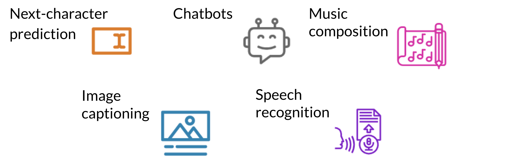

# Introduction to LSTMs

The LSTM allows your model to remember and forget certain inputs. It consists of a cell state and a hidden state with three gates. The gates allow the gradients to flow unchanged. You can think of the three gates as follows: 

* **Input gate**: tells you how much information to input at any time point. 

* **Forget gate**: tells you how much information to forget at any time point. 

* **Output gate**: tells you how much information to pass over at any time point. 

There are many applications you can use LSTMs for, such as:

