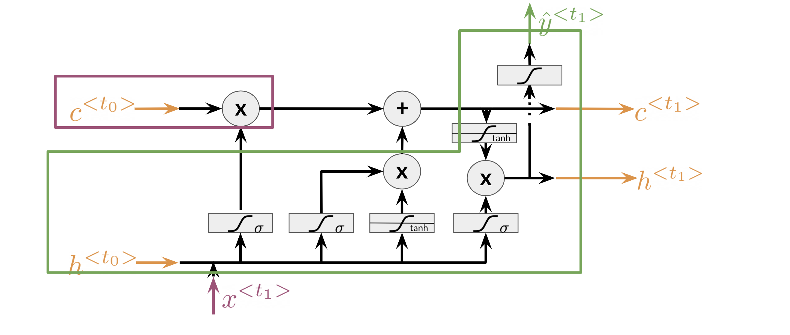

# LSTM Architecture

The LSTM architecture could get complicated and don't worry about it if you do not understand it. I personally prefer looking at the equation, but I will try to give you a visualization for now and later this week we will take a look at the equations. 

Note that there is the cell state and the hidden state, and then there is the output state. The **forget gate** is the first activation in the drawing above. It makes use of the previous hidden state h^{<t_0>} and the input x^{<t_1>}. The **input gate** makes use of the next two activations, the sigmoid and the tanh. Finally the **output gate** makes use of the last activation and the tanh right above it. This is just an overview of the architecture, we will dive into the details once we introduce the equations. 

