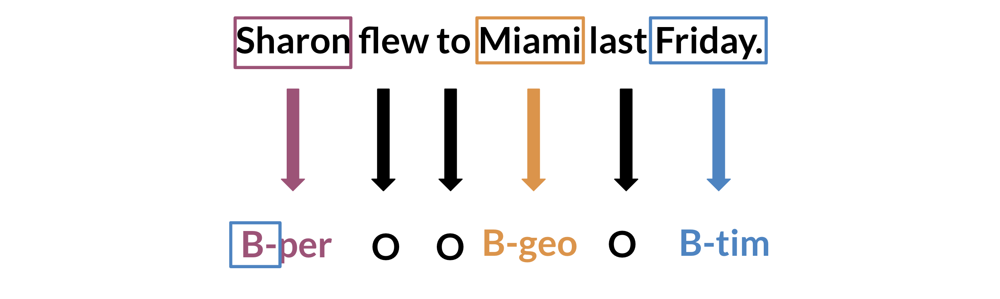

# Introduction to Named Entity Recognition

Named Entity Recognition (NER) locates and extracts predefined entities from text. It allows you to find places, organizations, names, time and dates. Here is an example of the model you will be building: 

NER systems are being used in search efficiency, recommendation engines, customer service, automatic trading, and many more. 