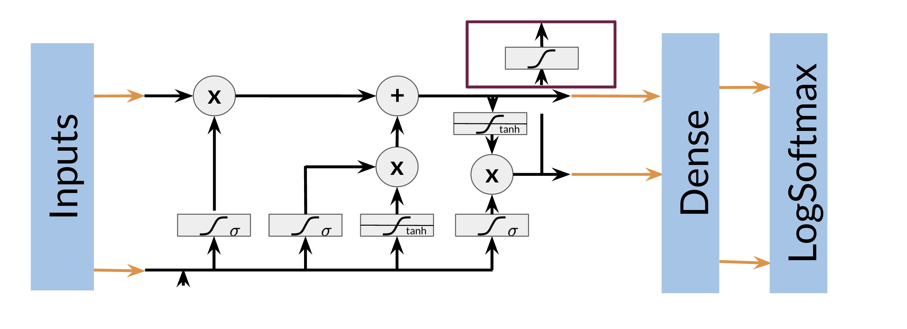

# Training NERs: Data Processing

Processing data is one of the most important tasks when training AI algorithms. For NER, you have to:

* Convert words and entity classes into arrays: 
* Pad with tokens: Set sequence length to a certain number and use the &lt;PAD&gt; token to fill empty spaces
* Create a data generator:

Once you have that, you can assign each class a number, and each word a number.

**Training an NER system**: 
1. Create a tensor for each input and its corresponding number 

2.  Put them in a batch ==> 64, 128, 256, 512 ...

3. Feed it into an LSTM unit

4. Run the output through a dense layer

5. Predict using a log softmax over K classes

Here is an example of the architecture: 

Note that this is just one example of an NER system. You can have different architectures. 

