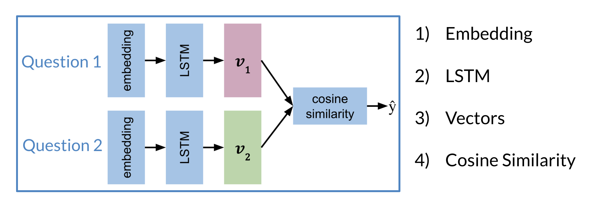

# Architecture

The model architecture of a typical siamese network could look as follows: 

These two sub-networks are sister-networks which come together to produce a similarity score. Not all Siamese networks will be designed to contain LSTMs. One thing to remember is that sub-networks share identical parameters. This means that you **only** need to train one set of weights and not two. 

The output of each sub-network is a vector. You can then run the output through a cosine similarity function to get the similarity score. In the next video, we will talk about the cost function for such a network.

