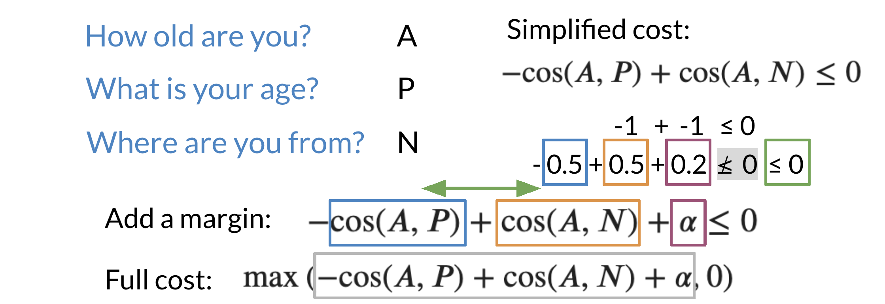

# Triplets

We will now build on top of our previous cost function. To get the full cost function you will add a margin. 

Note that we added an \alphaα in the equation above. This allows you to have a margin of "safety".  When computing the full cost, we take the max of that the outcome of -\cos(A,P) + \cos(A,N)  + \alpha −cos(A,P)+cos(A,N)+α and 0. Note, we do not want to take a negative number as a cost. 

Here is a quick summary:

* 𝜶: controls how far cos(A,P) is from cos(A,N)
* Easy negative triplet: cos(A,N) < cos(A,P)
* Semi-hard negative triplet:  cos(A,N) < cos(A,P) < cos(A,N) + 𝜶 
* Hard negative triplet: cos(A,P) < cos(A,N)
