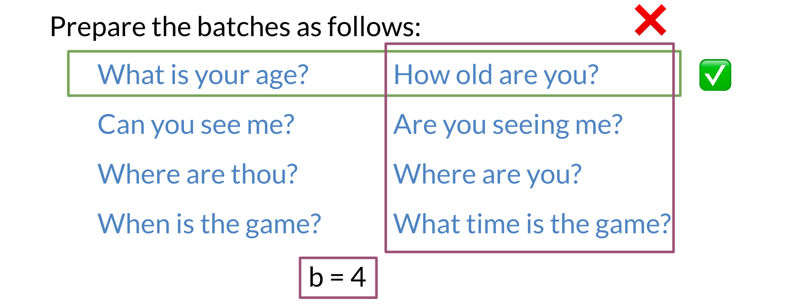

# Computing the Cost I

To compute the cost, we will prepare the batches as follows: 

Note that each example, has a similar example to its right, but no other example means the same thing. We will now introduce hard negative mining. 

Each horizontal vector corresponds to the encoding of the corresponding question. Now when you multiply the two matrices and compute the cosine, you get the following: 

The diagonal line corresponds to scores of similar sentences, (normally they should be positive). The off-diagonals correspond to cosine scores between the anchor and the negative examples. 