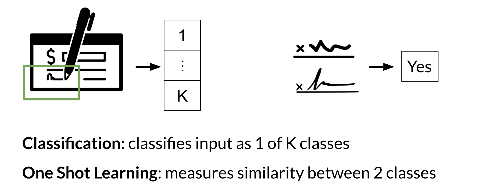

# One Shot Learning

Imagine you are working in a bank and you need to verify the signature of a check. You can either build a classifier with K possible signatures as an output or you can build a classifier that tells you whether two signatures are the same. 

Hence, we resort to one shot learning. Instead of retraining your model for every signature, you can just learn a similarity score as follows: 

