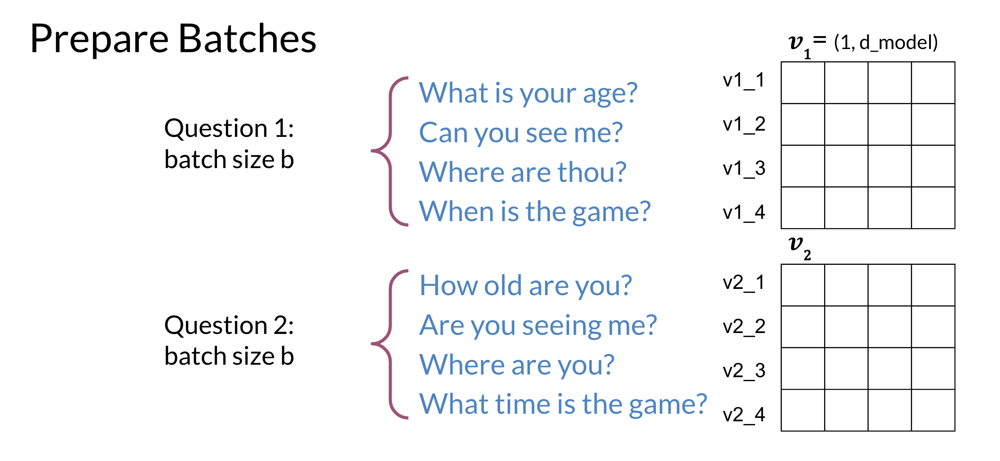
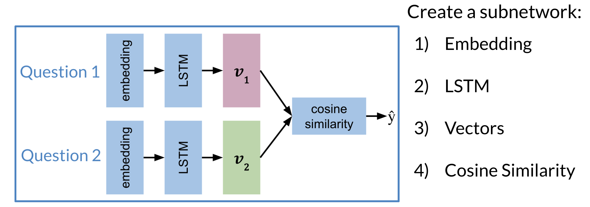

# Training / Testing

After preparing the batches of vectors, you can proceed to multiplying the two matrices. Here is a quick recap of the first step: 

The next step is to implement the siamese model as follows: 

Finally when **testing**: 

* Convert two inputs into an array of numbers
* Feed it into your model
* Compare 𝒗1,𝒗2 using cosine similarity
* Test against a threshold \tauτ