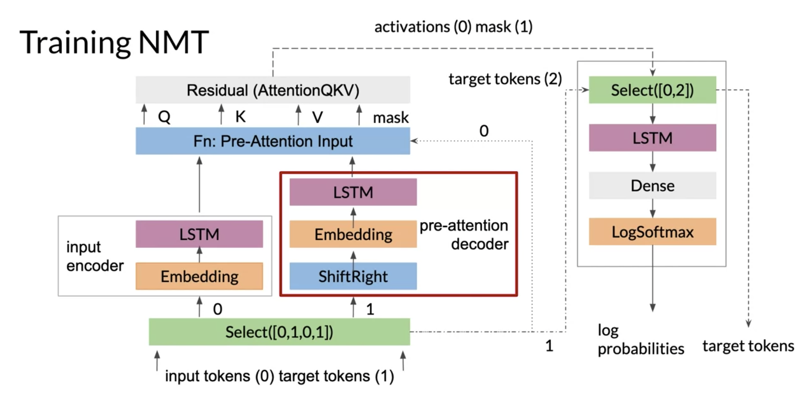

# Training an NMT with Attention

You will now get a detailed overview of what you will be implementing in the assignment. 

As you have previously seen, we will be using an encoder/decoder architecture but we will add attention to it. To help speed things up when training, we will also be using teacher forcing.  This yields faster training with the added benefits of higher accuracy.  At each time step when you make a prediction, you can peek into the right answer and feed it into the next time step. This will speed up the training ;) 

Let's take a careful look at what is happening here to make sure you understand how the training works. In this example, we are translating English tokens to German tokens. The input is represented by 0, and the target is represented by 1. One copy of the input tokens is fed into the inputs encoder to be transformed into the key and value vectors. Another copy of the target tokens goes into the pre-attention decoder. An important note here, the pre-attention decoder is not the decoder you were shown earlier, which produces the decoded outputs. The pre-attention decoder is transforming the prediction targets into a different vector space called the query vector.

Previously this week, I spoke about how you use $softmax(QK^T)V$ to get the input that you will feed into the decoder. The pre-attention decoder gets you that Q vector.  

To be even more specific, the pre-attention decoder takes the target tokens and shifts them one place to the right. This is where the teacher forcing takes place. Every token will be shifted one place to the right. That way when we predict,  we can just feed in the correct target word (i.e. teacher forcing). 

The input encoder gives you the **keys** and **values**.  Once you have the queries, keys, and values, you can compute the attention. Note in the image above, we used masking for the padded tokens. As a technical detail, in the assignment, the padding will be done by converting the padded tokens to -1 billion. When you compute the softmax of that, you get 0. Why is that the case? (Feel free to stop and convince yourself about that). 

After getting the output of your attention layer, the residual block adds the queries generated in the pre-attention decoder to the results of the attention layer. Then activations go to the second phase, with the mask that was previously created. We are now in the top right corner of the image. The Select is used to drop the mask.  It takes the activations from the attention layer or the 0, and the second copy of the target tokens, or the 2.  These are the true targets that the decoder needs to compare against the predictions. 

Finally, you just run everything through a decoder LSTM /dense layer or a simple linear layer with your target's vocab size. This gives your output the right size.  We use log softmax to compute the probabilities. The true target tokens are still hanging out here, and we'll pass down along with the log probabilities to be matched against the predictions. 

Note: 

Here's an additional resource from the blog <u>Towards Data Science</u> if you'd like to know more about Teacher Forcing, including pros/cons and a list of further resources. 

https://towardsdatascience.com/what-is-teacher-forcing-3da6217fed1c (Wong, 2019)