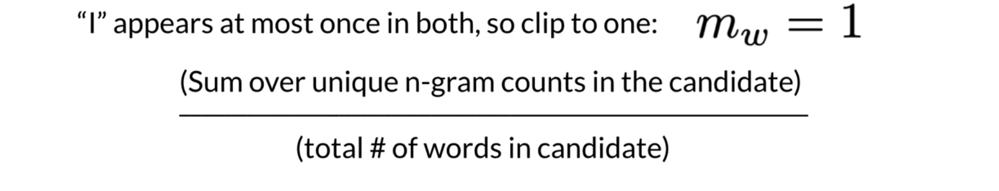
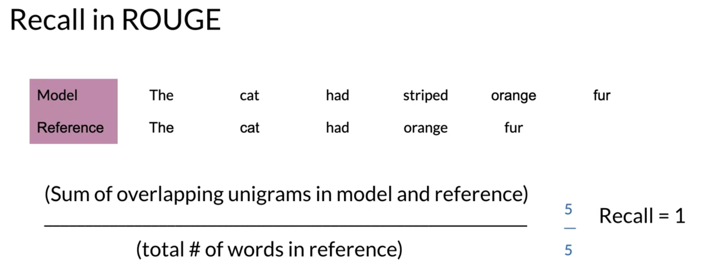
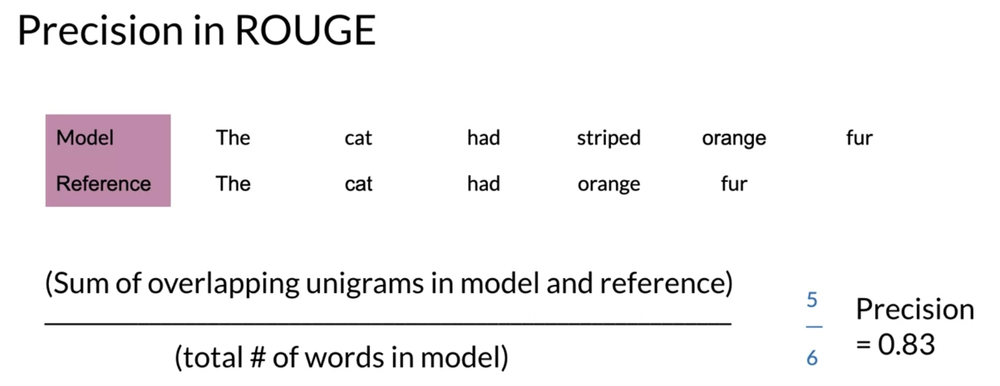

# Evaluation for Machine Translation

The closer the BLEU score is to one, the better your model is. The closer to zero, the worse it is. 

To get the BLEU score, the candidates and the references are usually based on an average of uni, bi, tri or even four-gram precision. To demonstrate, I'll use uni-grams as an example. Look at the following table:

To calculate the BLEU score you can do the following.

You would sum over the unique n-gram counts in the candidate and divide by the total number of words in the candidate. The same concept could apply to unigrams, bigrams, etc. One issue with the BLEU score is that it does not take into account semantics, so it does not take into account the order of the n-grams in the sentence.

Another similar method for evaluation is the ROUGE score which calculates precision and recall for machine texts by counting the n-gram overlap between the machine texts and a reference text.  Here is an example that calculates recall: 

Rouge also allows you to compute precision as follows: 

