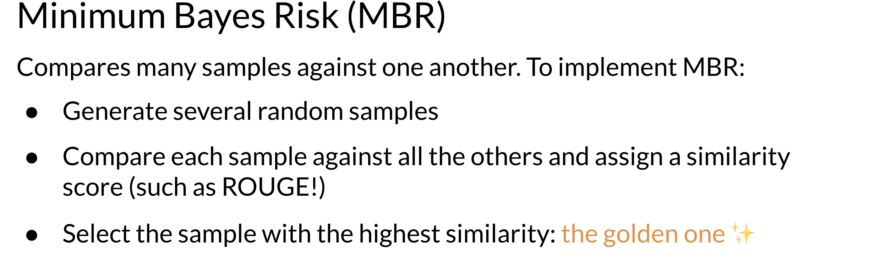

# Sampling and Decoding

You use decoding after all the calculations have been performed on the encoder hidden states and when you are ready to predict the next token. 

Greedy decoding is the simplest way to decode the model's predictions as it selects the most probable word at every step.  When you consider the highest probability for each prediction, and concatenate all predicted tokens for the output sequence as the greedy decoder does, you can end up with a situation where the output instead of I am hungry, gives you I am, am, am, am.

The other option is random sampling. In random sampling you provide probabilities for each word, and sample accordingly for the next outputs. In sampling, temperature is a parameter you can adjust to allow for more or less randomness in your predictions. It is measured on a scale of 0-1, indicating low to high randomness. Then there is beam search that gives you a window of size B (i.e. it allows you to look forward B time steps)

Instead of offering a single best output like in greedy decoding, beam search selects multiple options based on conditional probability. The search restriction I mentioned a moment ago is the beam width parameter B, which limits the number of branching paths based on a number that you choose, such as three. Then at each time step, the beam search selects B number of best alternatives with the highest probability as the most likely choice for the time step. Once you have these B possibilities, you can choose the one with the highest probability. The last method I spoke about is MBR. 

Here is a recap of ROUGE; ROUGE-N refers to the overlap of N-grams between the actual system and the reference summaries. 