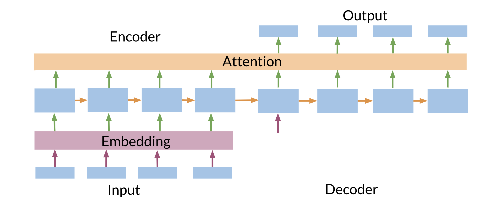

# Transformers vs RNNs

In the image above, you can see a typical RNN that is used to translate the English sentence "How are you?" to its German equivalent, "Wie sind Sie?". One of the biggest issues with these RNNs, is that they make use of sequential computation. That means, in order for your code to process the word "you", it has to first go through "are" and then "you". Two other issues with RNNs are the: 

* Loss of information: For example, it is harder to keep track of whether the subject is singular or plural as you move further away from the subject.

* Vanishing Gradient: when you back-propagate, the gradients can become really small and as a result,  your model will not be learning much. 

In contrast, transformers are based on attention and don't require any sequential computation per layer, only a single step is needed. Additionally, the gradient steps that need to be taken from the last output to the first input in a transformer is just one. For RNNs, the number of steps increases with longer sequences. Finally, transformers don't suffer from vanishing gradients problems that are related to the length of the sequences. Here is an image that might help you visualize it. 

We are going to talk more about how the attention component works with transformers. So don't worry about it for now :) 

