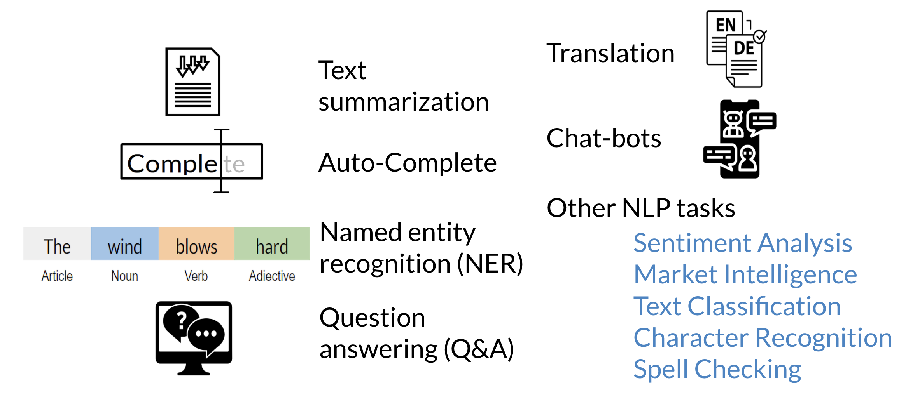
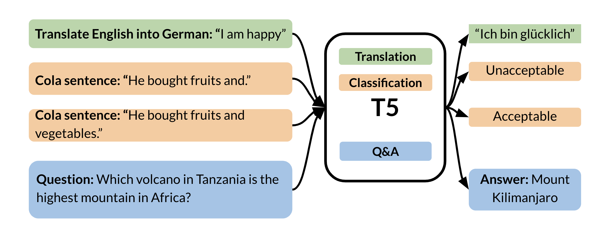

# Transformer Applications

Here is a brief summary of all the different applications you can build using transformers: 

It would be really cool if you can actually just go ahead and play trivia against a transformer: https://t5-trivia.glitch.me/ .

Another exciting area of research is the use of transfer learning with transformers. For example, to train a model that will translate English to German, you can just prepend the text "translate English to German" to the inputs that you are about to feed the model. You can then keep that same model to detect sentiment by prepending another tag. The following image summarizes the T5 model which uses this concept:

GPT-2, BERT, and T5 are some of the latest transformer models.
