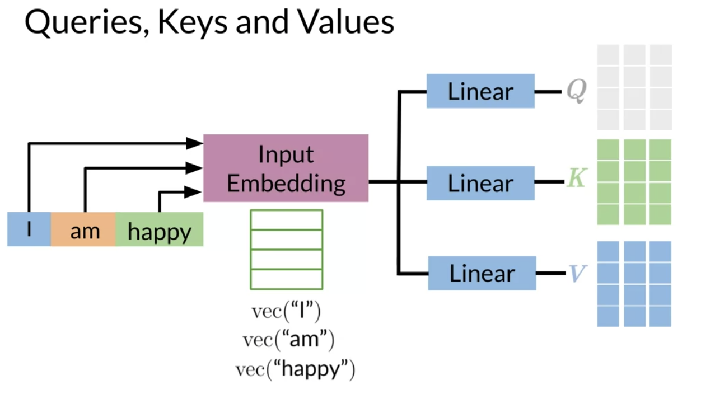
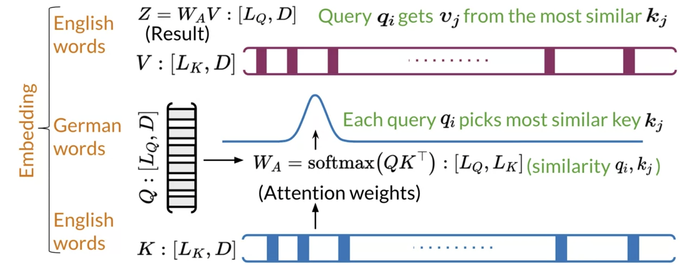

# Dot-Product Attention

Dot product attention could be summarized as follows:

Given an input, you transform it into a new representation or a column vector. Depending on the task you are working on, you will end up getting queries, keys, and values. Each column corresponds to a word in the figure above. Hence, when you compute the following: 

This concept implies that similar vectors are likely to have a higher score when you dot them with one another. You transform that score into a probability by using a softmax function. You can then multiply the output by VV. 

You can think of the **keys** and the **values** as being the same. Note that both K, V are of dimension L_k, D. Each query q_i picks the most similar key k_j. Queries are the German words and the keys are the English words. Once you have the attention weights, you can just multiply it by V to get a weighted combination of the input. 
