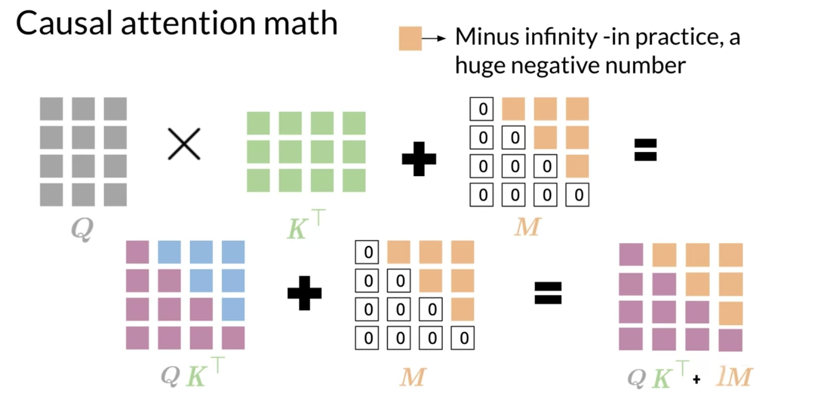

# Causal Attention

First, you'll see what are the three main types of attention. After, I'll show you a brief overview of causal attention. And finally, you'll discover some mathematical foundations behind the causal attention. 

There are **three** types of attention:

1) Encoder-decoder attention when a sequence (say German) attends to another one (such as English). You've already used this kind of attention last week when you built a translation model.

2) Causal attention is where in the same sentence, words attend to words in the past. This could be used for generating text such as summaries of long articles.

3)  Bi-directional self-attention is where words in the same sentence look both at previous and future words. 

In causal attention, queries and keys come from the same sentence. That is why it is often referred to as self-attention.  In general, causal attention allows words to attend to other words that are related in various ways. However, they cannot attend to words in the future since these were not generated yet. Mathematically, it looks like this: 

