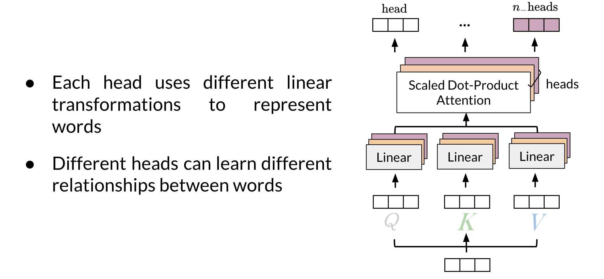
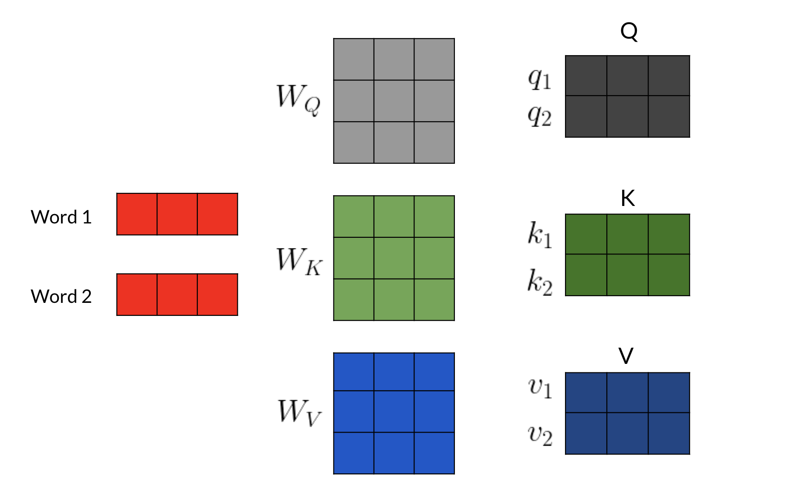
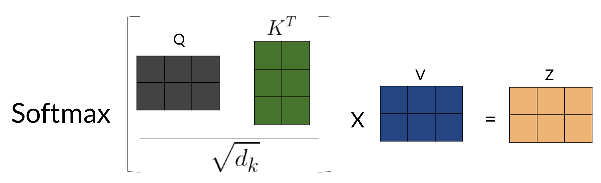
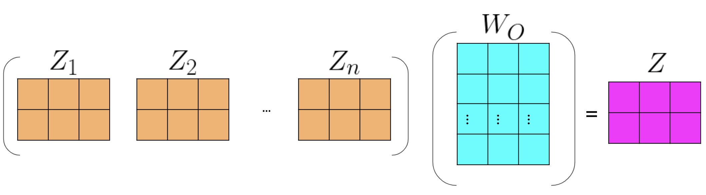

# Multi-head Attention

In this reading, I will summarize the intuition behind multi-head attention and scaled dot product attention.

Given a word, you take its embedding then you multiply it by the Q, K, V matrix to get the corresponding queries, keys and values. When you use multi-head attention, a head can learn different relationships between words from another head. 

Here's one way to look at it: 

*  First, imagine that you have an embedding for a word. You multiply that embedding with Q to get q_1, K to get k_1, and V to get v_1. 

* Next, you feed it to the linear layer, once you go through the linear layer for each word, you need to calculate a score. After that, you end up having an embedding for each word. But you still need to get the score for how much of each word you are going to use. For example, this will tell you how similar two words are q_1 and k_1 or even q_1 and k_2 by doing a simple q_1 \dot k_1. You can take the softmax of those scores (the paper mentions that you have to divide by \sqrt(d) to get a probability and then you multiply that by the value. That gives you the new representation of the word.

If you have many heads, you can concatenate them and then multiply again by a matrix that is of dimension (dim of each head by num heads - dim of each head) to get one final vector corresponding to each word. 

Here is step by step guide, first you get the Q, K, V matrices: 

For each word, you multiply it by the corresponding W_Q, W_K, W_V matrices to get the corresponding word embedding. Then you have to calculate scores with those embedding as follows: 

Note that the computation above was done for one head. If you have several heads, concretely nn, then you will have Z_1, Z_2, ..., Z_n. In which case, you can just concatenate them and multiply by a W_O matrix as follows:

Hence, the more heads you have, the more Zs you will end up concatenating and as a result, that will change the inner dimension of W_O, which will then project the combined embeddings into one final embedding. 