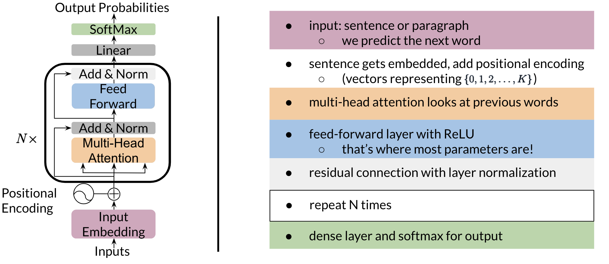

# Transformer Decoder

That was a lot of information! Don't worry if you did not understand everything, we will go over everything step by step. 

Once you get the embeddings, you append to it the positional encoding, which you can think of just a learned number that tells you information about the position of the word. Then, you do mutli-head attention as explained in the previous video/reading. There is a feedforward layer with a ReLU after, a residual connection with layer normalization (repeat the block shown above N times), finally a linear layer with a softmax. Zoning into the block that gets repeated N times, you get the following: 

Now for the feedforward block, you can just implement the following: 

You get the input, (red vector) run it through self-attention and then a feedforward with ReLU. At the end of the decoder, you can just run a softmax.

