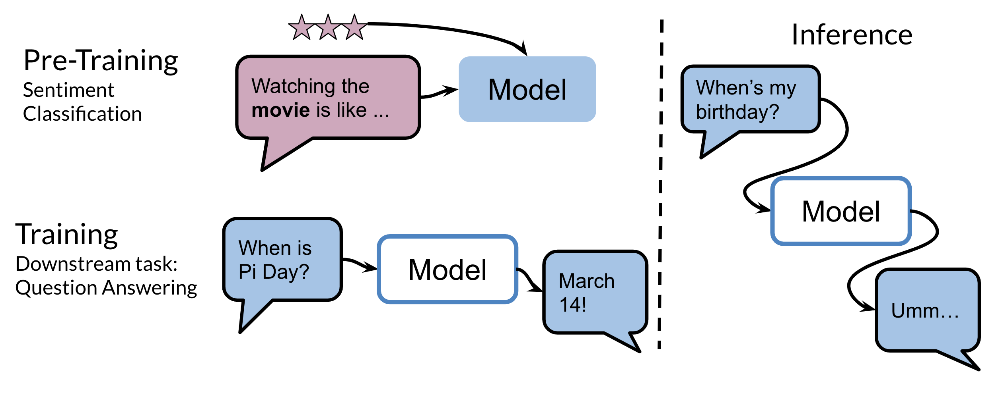
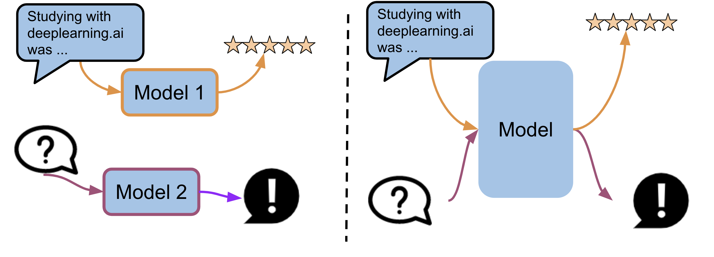

# Week 3 Overview

Welcome to Week 3! In this week you are going to learn about transfer learning and specifically you will understand how T5 and BERT actually work. 

In the image above, you can see how a model initially trained on some type of sentiment classification, could now be used for question answering. One other model that has state of the art makes use of multi tasking. For example, the same model could be used for sentiment analysis, question answering, and many other things. 

These new types of models make use of a lot of data. For example the C4 (colossal cleaned crawled corpus) is about 800 GB when all of the english wikipedia is just 13 GB! 

