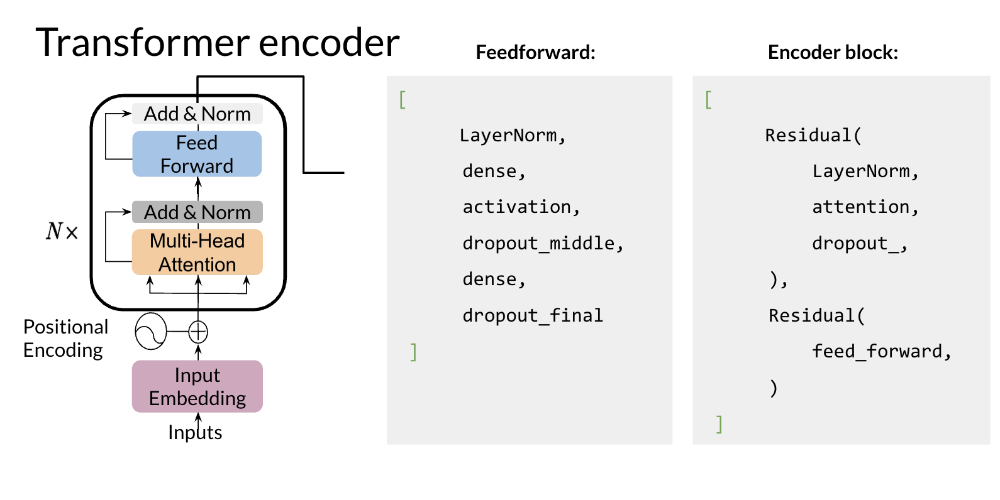

# Question Answering

You will be implementing an encoder this week. Last week you implemented the decoder. So here it is: 

You can see there is a feedforward and the encoder-block above. It makes use of two residual connections, layer normalization, and dropout. 

**The steps you will follow to implement it are**:

* Load a pre-trained model
* Process data to get the required inputs and outputs: "question: Q context: C" as input and "A" as * target
* Fine tune your model on the new task and input 
Predict using your own model
