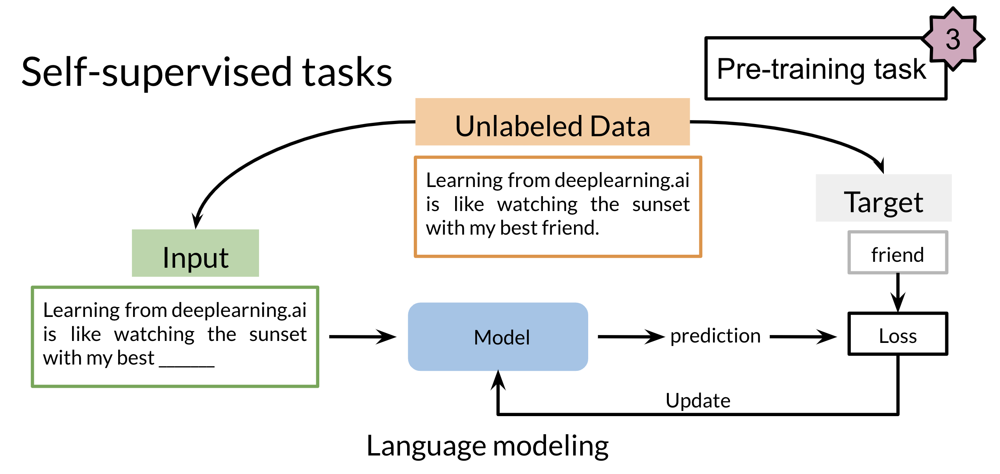

# Transfer Learning in NLP

There are three main advantages to transfer learning:

* Reduce training time
* Improve predictions
* Allows you to use smaller datasets

Two methods that you can use for transfer learning are the following:

In feature based, you can train word embeddings by running a different model and then using those features (i.e. word vectors) on a different task. 

When fine tuning, you can use the exact same model and just run it on a different task. Sometimes when fine tuning, you can keep the model weights fixed and just add a new layer that you will train. Other times you can slowly unfreeze the layers one at a time. You can also use unlabelled data when pre-training, by masking words and trying to predict which word was masked.

For example, in the drawing above we try to predict the word "friend". This allows your model to get a grasp of the overall structure of the data and to help the model learn some relationships within the words of a sentence. 