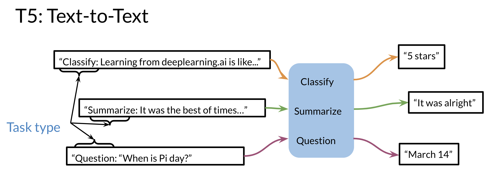

# ELMo, GPT, BERT, T5

The models mentioned in the previous video were discovered in the following order. 

In CBOW, you want to encode a word as a vector. To do this we used the context before the word and the context after the word and we use that model to learn and creates features for the word. CBOW however uses a fixed window C (for the context).

What's ElMo does,  it uses a bi-directional LSTM, which is another version of an RNN and you have the inputs from the left and the right.

Then Open AI introduced GPT. GPT unfortunately is uni-directional but it makes use of transformers. Although ElMo was bi-directional, it suffered from some issues such as capturing longer-term dependencies. Transformers help with that, but since GPT was still unidirectional, BERT was then introduced which stands for the Bi-directional Encoder Representation from Transformers. Last but not least, T5 was introduced which makes use of transfer learning and uses the same model to predict on many tasks. Here is an illustration of how it works.

