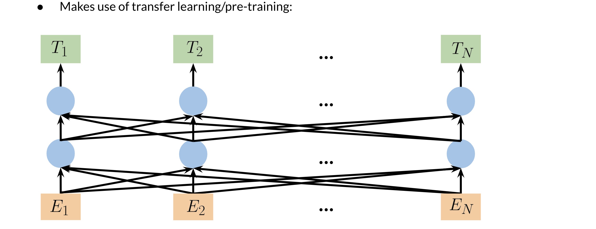

# Bidirectional Encoder Representations from Transformers (BERT)

You will now learn about the BERT architecture and understand how the pre-training works. 

There are two steps in the BERT framework: pre-training and fine-tuning. During pre-training, the model is trained on unlabeled data over different pre-training tasks.  For fine tuning, the BERT model is first initialized with the pre-trained parameters, and all of the parameters are fine-tuned using labeled data from the downstream tasks. For example, in the figure above, you get the corresponding embeddings for the input words, you run it through a few transformer blocks, and then you make the prediction at each time point T_i.

* Choose 15% of the tokens at random: mask them 80% of the time, replace them with a random token 10% of the time, or keep as is 10% of the time.  
* There could be multiple masked spans in a sentence
* Next sentence prediction is also used when pre-training.

The next video will talk about the BERT objective.

