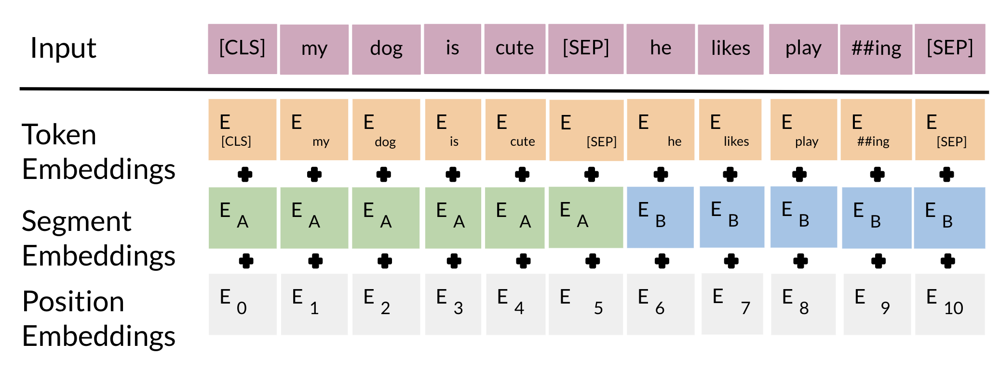
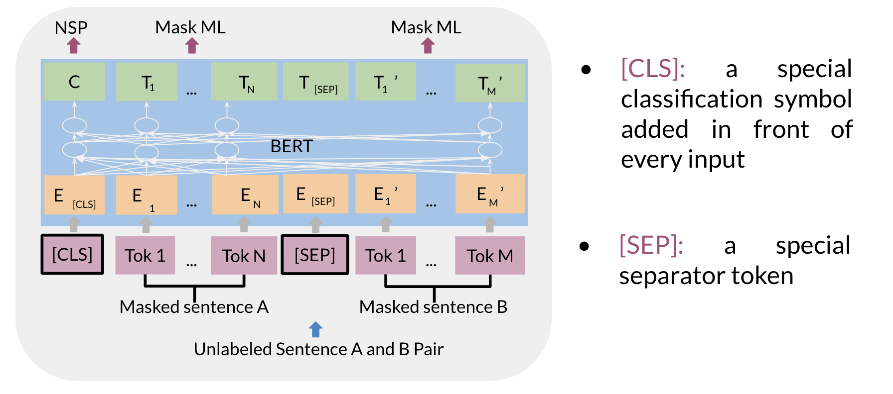

# BERT Objective

We will first start by visualizing the input. 

The input embeddings are the sum of the token embeddings, the segmentation embeddings and the position embeddings.

**The input embeddings**: you have a CLS token to indicate the beginning of the sentence and a sep to indicate the end of the sentence

**The segment embeddings**: allows you to indicate whether it is sentence a or b.

**Positional embeddings**: allows you to indicate the word's position in the sentence.

The C token in the image above could be used for classification purposes. The unlabeled sentence A/B pair will depend on what you are trying to predict, it could range from question answering to sentiment. (in which case the second sentence could be just empty). The BERT objective is defined as follows: 

You just combine the losses! 

